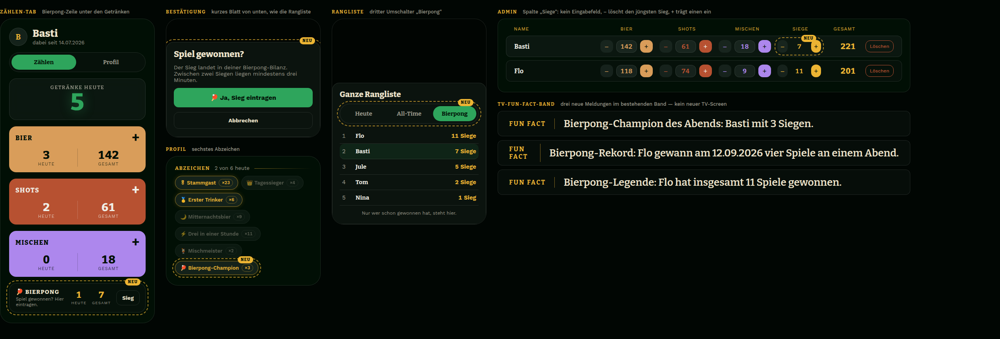
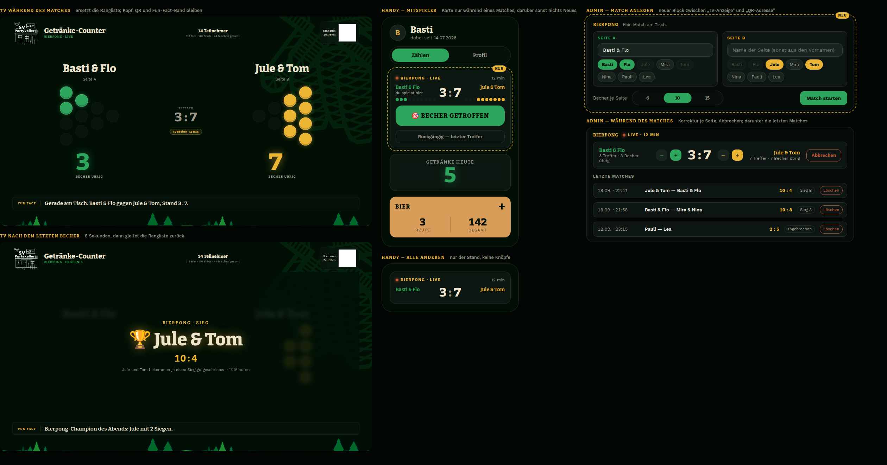

# Bierpong-Counter — zwei Entwürfe (Stand 2026-09-18, nicht umgesetzt)

Ausgangspunkt ist die Idee aus [ideen.md](../ideen.md): Bierpong-Siege im
Counter festhalten. Hier stehen zwei Ausbaustufen mit Anleitung zur Umsetzung.
**Entwurf 2 baut auf Entwurf 1 auf** — wer mit 1 anfängt, wirft nichts weg.

Eine Grenze gilt für beide: Getroffene Becher werden **nicht** als Getränke
gezählt, und es gibt keine Meldungen im Stil „X musste N Becher trinken".
Gezählt werden Spiele und Siege — ein Scoreboard fürs Spiel, nicht fürs
Trinken.

Die Mockups sind mit den echten Theme-Tokens, Fonts und Bausteinen der App
gebaut; gold gestrichelt = neu.

---

## Entwurf 1 — Sieg-Zähler (leichtgewichtig)



**Was der Gast sieht:** Unter den drei Getränke-Feldern im Zählen-Tab eine
schmale Zeile „🏓 Bierpong · Sieg eintragen" mit „heute / gesamt". Ein Tipp
öffnet eine kurze Bestätigung („Spiel gewonnen?"), dann steht der Sieg im Log.
Im Profil ein neues Abzeichen **Bierpong-Champion** (meiste Siege des Abends),
in der Ranglisten-Karte ein dritter Umschalter **Bierpong** (meiste Siege), im
TV-Band neue Fun-Facts. Kein neuer TV-Screen.

### Datenmodell

Nur ein Log, keine Zählerspalte — wie bei D-022 ist das Log die Quelle, Zähler
werden abgeleitet. Admin-Korrektur = Log-Zeile löschen oder anlegen, kein
„Zähler ohne Log" wie bei den Getränken.

```sql
CREATE TABLE IF NOT EXISTS game_log (
  id        INTEGER PRIMARY KEY AUTOINCREMENT,
  player_id TEXT NOT NULL REFERENCES players(id) ON DELETE CASCADE,
  game      TEXT NOT NULL CHECK (game IN ('bierpong')),   -- später: 'ragecage', 'kingscup', …
  ts        INTEGER NOT NULL
);
CREATE INDEX IF NOT EXISTS idx_game_log_player_ts ON game_log(player_id, ts);
CREATE INDEX IF NOT EXISTS idx_game_log_ts ON game_log(ts);
```

**Regeln:** Nutzer tragen nur den **eigenen** Sieg ein (Analogie zu D-004),
höchstens einen alle **3 Minuten** (ein Bierpong-Spiel dauert länger; Abfrage
`MAX(ts)` statt In-Memory, damit ein Neustart die Sperre nicht aufhebt). Admin
darf für jeden eintragen und löschen.

### Schritte

**1. `server/db.js`**
- Tabelle in den `db.exec`-Block hängen; keine Migration nötig,
  `CREATE TABLE IF NOT EXISTS` reicht.
- Prepared Statements: `insertWin(player_id, game, ts)`, `lastWinTs(player_id)`,
  `deleteWin(id)`, `deleteLatestWin(player_id)`
  (`DELETE … WHERE id = (SELECT id … ORDER BY ts DESC LIMIT 1)`),
  `winsAll` (`SELECT player_id, COUNT(*) n FROM game_log GROUP BY player_id`),
  `winsToday(dayStart)` (mit `ts >= ?`), `winsByDay`
  (`SELECT player_id, ts FROM game_log ORDER BY ts`), `backupGames`,
  `insertGameFull`, `clearGames`.
- Funktionen: `logWin(playerId, game, ts = Date.now())`, `lastWinTs(playerId)`,
  `deleteLatestWin(playerId)`, `deleteWin(id)`.
- `rankedPlayers()`: zwei Maps aus `winsAll`/`winsToday` befüllen und jedem
  Spieler `wins` und `winsToday` mitgeben. Das Log ist winzig (eine Handvoll
  Spiele pro Abend), deshalb kein Historien-Cache (D-047) nötig — nur ein
  Kommentar, warum nicht.
- `getPlayerStats()`: neues Abzeichen `pongChampion`. Siege aller Spieler mit
  `partyDayString(ts)` nach Tag gruppieren; pro Tag gewinnt, wer die meisten
  Siege hat, bei Gleichstand wer die Zahl zuerst erreicht hat (dasselbe
  Tie-Break wie `getDayWinners`). `counts`/`todayFlags` um den Key erweitern.
- `getFunStats()`: `pongTop` (meiste Siege all-time, `{name, wins}`),
  `pongRecord` (meiste Siege an einem Abend, `{name, day, n}`). Ausgeblendete
  Spieler wie bei `topWinner` überspringen.
- `resetAll`: `stmts.clearGames.run()` dazu. `deletePlayer` braucht nichts —
  CASCADE.
- `exportBackup()`: `gameLog: stmts.backupGames.all()`. `importBackup`:
  `clearGames` + Schleife über `data.gameLog`.
- Export-Objekt am Ende um die neuen Funktionen ergänzen.

**2. `server/backup.js`**
- `LIMITS.gameLog = 20000`.
- In `parseBackup` einen Block wie `drinkLog`, aber **optional**:
  `const gameRows = Array.isArray(data.gameLog) ? list(data, 'gameLog') : [];`
  — so bleiben alte Sicherungen ohne `gameLog` einspielbar, `BACKUP_VERSION`
  bleibt 1. Prüfen: `player_id` bekannt, `game === 'bierpong'`, `ts`
  ganzzahlig > 0.

**3. `server/ws.js`** — zwei Handler in `createHandlers`:

| Nachricht | Wer | Regel |
|---|---|---|
| `logWin(playerId, game)` | Nutzer/Admin | Nutzer: nur `auth.sub === playerId`, Sperre 3 min (`db.lastWinTs`). Admin: jeder Spieler. `game` muss `'bierpong'` sein. |
| `deleteWin(playerId)` | Admin | löscht den jüngsten Sieg des Spielers (`deleteLatestWin`), Fehler wenn keiner da |

Fehlermeldung bei Sperre im Projektton: „Das nächste Spiel dauert sicher
länger als drei Minuten. 🏓". `area.broadcast()` läuft nach jedem Handler
ohnehin.

**4. `public/js/facts.js`** in `computeFacts`:
- `kind = 'heute'`: `leaderBy(players, 'winsToday')` → „Bierpong-Champion des
  Abends: Basti mit 3 Siegen." (Singular „einem Sieg" beachten).
- `kind = 'rekord'`: `fs.pongRecord && n >= 2` → „Bierpong-Rekord: Flo gewann
  am 12.09.2026 vier Spiele an einem Abend."
- `kind = 'statistik'`: `fs.pongTop && wins >= 3` → „Bierpong-Legende: Basti
  hat insgesamt 11 Spiele gewonnen."

**5. `public/dashboard.html`**
- Nach dem Mischen-Feld (vor `</div><!-- /#tab-count -->`) eine neue Zeile —
  bewusst **kein** viertes `.drink`-Feld, sondern eine flache Glaszeile
  (`.glass`, `--surface-alt`), damit die drei Getränke optisch die Getränke
  bleiben: links „🏓 Bierpong", Mitte `wins-today`/`wins-total` als `.num`,
  rechts Knopf „Sieg" (`.btn-flat`).
- Bestätigung: kleines Blatt nach dem Muster von `board-modal` („Spiel
  gewonnen? — Ja, Sieg eintragen / Abbrechen"). Dann
  `ws.send({ type: 'logWin', token, playerId, game: 'bierpong' })` neben `send`.
- `onState`: `bump('wins-today', me.winsToday)`, `bump('wins-total', me.wins)`.
- Abzeichen: `<div id="badge-pong" class="badge" title="Meiste Bierpong-Siege
  des Abends">🏓 Bierpong-Champion <span class="badge-count">×0</span></div>`;
  in `loadStats` das Paar `['badge-pong', 'pongChampion']` in die Liste und
  `von 5 heute` → `von 6 heute`.
- Ranglisten-Karte: dritter Scope `pong` in `boardEntries()` — sortiert nach
  `wins`, Anzeige „N Siege", Spieler mit 0 Siegen ausblenden. Umschalter-Knopf
  im Modal ergänzen; `.tabs[data-pos="2"]` existiert in `theme.css` bereits.

**6. `public/admin.html`**
- Tabellenkopf: Spalte „Siege" (110 px) nach „Mischen"; Getränke-Spalten von
  170 auf 150 px, dann passt es in die 1200 px.
- In `renderPlayers` neben `stepper(…)` eine Zelle `winCell`: „–" sendet
  `deleteWin`, Zahl `p.wins` als reiner Text (kein Eingabefeld — es gibt
  keinen Zähler zum Setzen), „+" sendet `logWin`. Farbe: `--gold`, nicht die
  Getränkefarben.

**7. `server/seed.js`:** zwei, drei `db.logWin(p.id, 'bierpong')` für
Basti/Flo, damit Facts und Abzeichen im Dev-Lauf etwas zeigen.

**8. Doku:** `DECISIONS.md` (Log-only-Modell, 3-Minuten-Sperre, Selbsteintrag
statt Admin-Pflicht, keine Getränke-Kopplung), `PLAN.md` §3 (Tabelle) und §5
(zwei Nachrichten), `CLAUDE.md` Regel 6 („… um +1 erhöhen und den eigenen
Sieg eintragen"), `README.md` Feature-Liste, `PROGRESS.md`.

**Optional:** TV-Modus „Bierpong" als vierter `setBoardMode`-Wert — die
Rangliste nach Siegen mit Spalten „heute / gesamt". Braucht in `tv.html` eine
Spaltenvariante und in `theme.css` `.tabs[data-pos="3"]`. Erst mal weglassen;
die Fun-Facts bringen die Siege ohnehin auf den Fernseher.

**Prüfen:** Sieg als Nutzer → Zeile springt, zweiter Tipp innerhalb 3 min →
Fehlertext; Admin „–" entfernt ihn wieder; Backup exportieren, Reset,
einspielen → Siege wieder da; altes Backup ohne `gameLog` einspielen → geht;
Nutzer löschen → Siege weg; Fun-Fact-Übersicht im Admin zeigt die neuen
Meldungen.

**Umfang:** ~250 Zeilen, 8 Dateien, 4 Commits (DB+Backup · WS ·
Dashboard+Facts · Admin+Doku). Ein Abend.

---

## Entwurf 2 — Live-Match-Tracker



**Was passiert:** Admin startet im Admin-Dashboard ein Match: zwei Seiten
(Name + 0–4 verknüpfte Konten je Seite), Becher pro Seite (6/10/15). Ab dann
ersetzt auf dem TV ein Match-Screen die Rangliste: zwei Hälften, je Seite der
Name und die restlichen Becher als **Rack** (10 Becher = 4-3-2-1-Dreieck,
6 = 3-2-1, 15 = 5-4-3-2-1), die Spitze zeigt zum Gegner wie am Tisch;
getroffene Becher werden ausgegraut. Auf dem Handy bekommen die Mitspieler
oben im Zählen-Tab eine Match-Karte mit dem Stand und dem Knopf **Becher
getroffen** (plus „Rückgängig"); alle anderen sehen nur den Stand. Fällt der
letzte Becher einer Seite, ist das Match vorbei: TV zeigt 8 Sekunden
„🏆 Team X gewinnt 10 : 4" und gleitet zurück zur Rangliste; jedes verknüpfte
Konto der Siegerseite bekommt automatisch eine Zeile in `game_log` —
Abzeichen, Rangliste und Fun-Facts aus Entwurf 1 laufen ohne Änderung weiter.

**Bewusste Grenzen:** genau **ein** laufendes Match je Bereich (der TV hat
einen Screen; das nächste erst nach Ende oder Abbruch). Kein Regelwerk im
Server — ein Tipp ist ein Becher, Bounce, Trickshot oder Nachwurf klärt der
Tisch. Seiten ohne verknüpfte Konten sind erlaubt (Gäste ohne Account), dann
gibt es nur keine Siegzeilen.

### Datenmodell (zusätzlich zu `game_log`)

```sql
CREATE TABLE IF NOT EXISTS matches (
  id          INTEGER PRIMARY KEY AUTOINCREMENT,
  game        TEXT NOT NULL CHECK (game IN ('bierpong')),
  cups        INTEGER NOT NULL,                        -- Becher je Seite zu Beginn
  side_a      TEXT NOT NULL,  side_b TEXT NOT NULL,    -- Anzeigename der Seite
  hits_a      INTEGER NOT NULL DEFAULT 0,              -- Treffer VON Seite A (= Becher, die B verloren hat)
  hits_b      INTEGER NOT NULL DEFAULT 0,
  status      TEXT NOT NULL CHECK (status IN ('live','done','cancelled')),
  winner      TEXT CHECK (winner IN ('a','b')),
  started_at  INTEGER NOT NULL,
  ended_at    INTEGER
);
CREATE TABLE IF NOT EXISTS match_players (
  match_id  INTEGER NOT NULL REFERENCES matches(id) ON DELETE CASCADE,
  player_id TEXT NOT NULL REFERENCES players(id) ON DELETE CASCADE,
  side      TEXT NOT NULL CHECK (side IN ('a','b')),
  PRIMARY KEY (match_id, player_id)
);
CREATE TABLE IF NOT EXISTS match_events (                -- für Rückgängig und „wer hat getroffen"
  id        INTEGER PRIMARY KEY AUTOINCREMENT,
  match_id  INTEGER NOT NULL REFERENCES matches(id) ON DELETE CASCADE,
  side      TEXT NOT NULL CHECK (side IN ('a','b')),
  player_id TEXT REFERENCES players(id) ON DELETE SET NULL,
  delta     INTEGER NOT NULL CHECK (delta IN (1,-1)),
  ts        INTEGER NOT NULL
);
CREATE UNIQUE INDEX IF NOT EXISTS idx_matches_live ON matches(game) WHERE status = 'live';
```

Der partielle Unique-Index erzwingt „ein Live-Match" auf DB-Ebene, nicht nur
im Handler. `game_log` bekommt eine Spalte
`match_id INTEGER REFERENCES matches(id) ON DELETE SET NULL` (Migration per
`PRAGMA table_info` wie bei `mixes`), damit das Löschen eines Matches die
Siege nicht mitreißt, aber der Bezug erhalten bleibt.

### Zustand (in `getState()`, nur wenn vorhanden)

```jsonc
"match": {
  "id": 12, "game": "bierpong", "cups": 10, "status": "live",
  "a": { "name": "Basti & Flo", "players": [{"id":"…","name":"Basti"}, …], "hits": 6, "remaining": 4 },
  "b": { "name": "Jule & Tom",  "players": [...], "hits": 3, "remaining": 7 },
  "startedAt": 1789000000000, "endedAt": null, "winner": null,
  "lastHit": { "side": "a", "ts": 1789000123000 }
}
```

`remaining` der Seite A = `cups − hits_b`. Ein beendetes Match bleibt
**60 Sekunden** nach `ended_at` im State (Abfrage
`status = 'done' AND ended_at > ?`), damit ein TV, der gerade neu verbindet,
das Ergebnis noch zeigt — danach ist `match` wieder `null`.

### WebSocket-Nachrichten (alle in `createHandlers`)

| Nachricht | Wer | Regel |
|---|---|---|
| `startMatch(sideA:{name, playerIds}, sideB:{…}, cups)` | Admin | Namen via `validName`, `cups` ganzzahlig 1–20, max. 4 Konten je Seite, jedes Konto nur auf einer Seite, alle Konten existieren; Fehler wenn schon ein Live-Match läuft |
| `hitCup(matchId, side)` | Mitspieler der Seite / Admin | `side` = Seite, die getroffen hat; nur wenn `status = 'live'`; nach dem Hochzählen: ist `remaining` der Gegenseite 0 → Match beenden (Transaktion, s. u.) |
| `undoHit(matchId, side)` | Mitspieler der Seite / Admin | letztes Event der Seite mit `delta = 1` zurücknehmen (`hits` nie < 0), Event mit `delta = -1` anhängen |
| `cancelMatch(matchId)` | Admin | `status = 'cancelled'`, keine Siege |
| `deleteMatch(matchId)` | Admin | nur beendete/abgebrochene; CASCADE räumt Events auf, `game_log.match_id` wird NULL — Siege bleiben, das Löschen der Siege bleibt eine eigene Entscheidung |

Mitspieler-Prüfung: `auth.role === 'player'` → `match_players` muss
`(matchId, auth.sub, side)` enthalten, sonst „Du spielst nicht auf dieser
Seite". Die vorhandene Drossel (`allowIncrement`) in `wss.on('message')` auch
für `hitCup`/`undoHit` anwenden — reicht, Würfe kommen nicht im Sekundentakt.

**Match-Ende** als `db.transaction`: `status = 'done'`, `winner`, `ended_at`;
für jedes Konto der Siegerseite `insertWin(player_id, 'bierpong', ts,
match_id)`. Dadurch Sieg und Ergebnis nie halb (Muster D-046).

### Schritte

**1. `server/db.js`** — drei Tabellen + `game_log.match_id`-Migration;
Statements `getLiveMatch`, `getRecentDone(sinceTs)`, `insertMatch`,
`insertMatchPlayer`, `listMatchPlayers(matchId)`, `updateHits`, `finishMatch`,
`cancelMatch`, `insertEvent`, `lastHitEvent(matchId, side)`,
`listMatches(limit)`, `deleteMatch`, Backup-Statements für alle drei.
Funktionen `startMatch(...)`, `hitCup(id, side)` (gibt `{ finished, winner }`
zurück), `undoHit`, `cancelMatch`, `deleteMatch`, `getMatchState()` (baut das
obige Objekt), `listMatches(20)` fürs Admin. `getState()`:
`match: getMatchState()`. `resetAll`/`importBackup`: drei `clear*`.
`getFunStats()`: `pongMatches` (Anzahl beendeter Matches) und `pongLongest`
(Match mit den meisten Gesamttreffern und Dauer) für zwei weitere Facts.

**2. `server/backup.js`** — `matches`, `matchPlayers`, `matchEvents` als
optionale Listen (`LIMITS` 2000 / 8000 / 60000) mit Plausibilitätsprüfung
(Status-Enum, `cups` 1–20, `match_id` bekannt, `player_id` bekannt oder null).

**3. `server/validate.js`** — `validCups(n)`: ganzzahlig, 1–20.
`validSide(s)`: `'a' | 'b'`.

**4. `server/ws.js`** — die fünf Handler; `hitCup` ruft `db.hitCup` und wirft
nichts weiter — der Broadcast danach trägt den neuen Stand (inklusive
`status: 'done'`) an alle.

**5. `public/js/ws-client.js`** — keine Änderung: `match` reist im `state` mit.

**6. `public/tv.html`**
- Neues `<div id="match" hidden>` als Geschwister von `#board`, gleiche
  Flex-Fläche. Aufbau: `display:grid; grid-template-columns:1fr 200px 1fr`,
  Mitte Treffer-Stand `hits_a : hits_b` in `.num`, darunter eine Pill mit
  Becherzahl und Dauer. Je Seite: Seitenname in Bitter 800/56 px, darunter das
  Rack als Spalten aus Kreisen (`border-radius:50%`, 66 px, Seitenfarbe mit
  Glow; getroffen = `--surface-2`, gestrichelter Rand, `opacity:0.35`,
  Übergang 0.3 s), darunter die Restzahl groß (120 px) mit „Becher übrig".
  Rack-Spalten aus `cups` ableiten: größte Reihe `k` mit `k(k+1)/2 ≥ cups`,
  dann von der Basis zur Spitze auffüllen — 10 → 4-3-2-1, 6 → 3-2-1,
  15 → 5-4-3-2-1, krumme Zahlen füllen die Spitze unvollständig. Seite A: Basis
  links, Spitze zeigt nach rechts; Seite B gespiegelt (`flex-direction:
  row-reverse`).
- Seitenfarben: A `--green`, B `--gold` — bewusst keine Getränkefarben, und
  beide Töne existieren in beiden Bereichs-Themes (D-019).
- Untertitel `#board-subtitle` während des Matches „Bierpong · live", beim
  Ergebnis „Bierpong · Ergebnis", danach zurück auf den Modus-Text aus
  `applyState`.
- `onState`: `if (state.match) showMatch(state.match) else hideMatch()`.
  Ein-/Ausblenden über das vorhandene `slideSwap`, damit der Wechsel aussieht
  wie ein Moduswechsel. Bei `status === 'done'`: das Rack dimmt (`opacity:
  0.35`), darüber ein Overlay mit Pokal, Siegername, Endstand und Zeile „Jule
  und Tom bekommen je einen Sieg gutgeschrieben · 14 Minuten", 8 s per
  `setTimeout`, dann `hideMatch()` — der Server hält das Objekt ohnehin nur
  60 s. Letzter Treffer: die getroffene Kugel kurz `pk-pop` (Klasse gibt es in
  `theme.css`).
- Fun-Fact-Band, QR und Kopf bleiben stehen — nur die Board-Fläche wechselt.
- Bekannte Grenze: bei 15 Bechern wird das Rack fünf Spalten breit; passt
  noch, aber die Restzahl rutscht dann unter das Rack.

**7. `public/dashboard.html`**
- Über „Getränke heute" ein `<div id="match-card" class="card" hidden>`: Kopf
  „🏓 Bierpong · live" (roter Punkt) plus Dauer, Stand `A 3 : 7 B` mit
  Seitennamen in Seitenfarbe und Mini-Racks aus 10 Punkten; darunter — nur
  wenn `me` auf einer Seite steht — ein breiter Knopf **Becher getroffen** in
  der eigenen Seitenfarbe und ein kleiner „Rückgängig — letzter Treffer".
  Nicht-Mitspieler sehen nur die Stand-Zeile. Ohne Match ist die Karte
  `hidden` — der Zählen-Tab sieht im Ruhezustand aus wie heute.
- `onState`: `renderMatch(state.match, playerId)`; Sendeaufrufe
  `ws.send({ type:'hitCup', token, matchId, side })`, entsprechend `undoHit`.
  Nach `status: 'done'` die Karte 8 s als Ergebnis zeigen, dann verstecken.
- Bekannte Grenze: auf einem kleinen Handy nimmt die Karte den halben
  Bildschirm; „Getränke heute" rutscht aus dem ersten Blick — Preis dafür,
  dass der Treffer-Knopf ohne Scrollen erreichbar ist.

**8. `public/admin.html`**
- Neuer Glas-Block **Bierpong** zwischen „TV-Anzeige" und „QR-Adresse". Ohne
  Live-Match: zwei Spalten „Seite A / Seite B", je ein Namensfeld
  (`input-flat`, `maxlength=24`) und darunter Konten-Chips zum Antippen (aus
  `state.players`, Auswahl max. 4, ein Konto nicht auf beiden Seiten — bei
  Wahl auf der anderen Seite ausgrauen); Auswahl `cups` 6/10/15 als
  `.tabs`-Umschalter; „Match starten" (`.btn-green`). Namensfeld leer + Konten
  gewählt → Name aus den Vornamen bauen („Basti & Flo").
- Mit Live-Match: Stand groß, je Seite „+ Treffer" / „– Treffer"
  (Admin-Korrektur über `hitCup`/`undoHit`), „Abbrechen" (`.btn-flat` in
  `--brick`, mit `confirm`).
- Darunter „Letzte Matches" (`GET /api/matches`, Admin-Header wie die
  CSV-Routen): Datum, Seiten, Ergebnis, Status, „Löschen".
- `tv-mode`-Umschalter braucht nichts Neues: das Match überlagert jeden Modus.

**9. `server/index.js`** — `router.get('/matches')` mit `requireAdmin`,
Antwort `{ matches: db.listMatches(20) }`.

**10. `public/js/facts.js`** — zusätzlich: `kind='statistik'`:
„Bierpong-Bilanz: 14 Matches gespielt, das längste ging 27 Minuten."
(`pongMatches >= 3`); `kind='moment'`: läuft ein Match, „Gerade am Tisch:
Basti & Flo gegen Jule & Tom, Stand 3 : 7." — nur wenn
`state.match?.status === 'live'`; dafür `computeFacts` einen fünften Parameter
`match` geben und in `tv.html`/`admin.html` durchreichen.

**11. `public/abende.html`** (optional): pro Abend-Karte eine Zeile
„🏓 3 Bierpong-Matches · Champion: Basti" aus `GET /api/archive` — dafür
`getArchive()` um `pongMatches`/`pongChampion` je Tag ergänzen. Kein Muss.

**12. Doku:** DECISIONS (ein Live-Match je Bereich, Treffer-Log statt
Zählerspalte, Sieger-Anzeige 60 s im State, keine Getränke-Kopplung, kein
Regelwerk), PLAN §3/§5/§6, CLAUDE.md Regel 6 („Mitspieler dürfen im eigenen
Match Treffer melden"), README, PROGRESS.

**Prüfen (Playwright, wie bisher):** Match starten → TV gleitet zum Rack,
Handy von Basti zeigt Knopf, Handy von Nina nur den Stand; 10 Treffer von A →
TV zeigt Sieger, nach 8 s Rangliste, Basti und Flo je +1 Sieg in Rangliste und
Abzeichen; Undo bei 0 → Fehler; zweites `startMatch` während live → Fehler;
Server-Neustart mitten im Match → Match steht nach Reconnect unverändert
(D-006); Abbrechen → keine Siege; Backup-Roundtrip mit laufendem Match; Nutzer
löschen, der im Match steht → Match läuft ohne ihn weiter (CASCADE in
`match_players`, SET NULL in `match_events`).

**Umfang:** ~800 Zeilen, 3 Tabellen + 1 Spalte, 5 Nachrichten, 1 REST-Route,
neuer TV-Screen, ~7 Commits (Schema+Backup · WS-Handler · TV · Dashboard ·
Admin · Facts+Archiv · Doku). Zwei bis drei Abende, das Meiste davon
TV-Layout und Admin-Formular.

---

## Empfehlung

Entwurf 1 zuerst — er ist in einem Abend fertig, und alles, was er anlegt
(`game_log`, Abzeichen, Facts, Rangliste), nutzt Entwurf 2 unverändert weiter.
