# Design-Analyse & Entwürfe (Stand 2026-09-24)

Durchgesehen wurden alle Seiten in beiden Bereichen: Startseite, Anmeldung,
Onboarding, Dashboard (Zählen, Profil, Ranglisten-Blatt), TV, Abend-Archiv
und Admin. Grundlage sind Screenshots aus dem laufenden Server (Chromium,
Handy 390 px, TV 1920 × 1080, Admin 1440 px) mit 20 Testkonten.

**Stand der Umsetzung:** TV-Verlauf (D-053), alle Fehler A1–A13, E4 und E5
(D-054) sind umgesetzt. Von E3 sind A2, A12 und A13 umgesetzt; offen bleiben
die offenen Abzeichen und „war später dran“ beim Hintermann. E7 (Admin,
ersetzt E6) ist umgesetzt (D-061), mit „Danger Zone“ statt „Gefahrenzone“.
E1 und E2 sind weiter Entwürfe und warten auf eine Entscheidung. Die Bilder in `docs/design-review/`
zeigen die echte App, in die die vorgeschlagenen Änderungen per CSS/JS
eingespielt wurden. Links steht der heutige Stand, rechts der Entwurf.

---

## Gesamteindruck

Die Grundlage ist stark und in sich stimmig. Die Farben tragen jeweils eine
Bedeutung: Bier amber, Shots brick, Mischen violett, Platzfarben
Gold/Silber/Bronze. Die Schrift (Bitter für Zahlen und Titel, Work Sans für
Text) ist sauber getrennt, und das Glas-Thema zieht sich durch alle Seiten.
Die Youngstars-Variante funktioniert über dieselben Tokens. Die
Unstimmigkeiten kommen fast alle daher, dass jede Seite ihre Bausteine
(Knöpfe, Felder, Dialoge, Etiketten) selbst mitbringt und diese über die
Zeit auseinandergelaufen sind.

---

## A. Unstimmigkeiten (klare Fehler) ✅ alle umgesetzt (D-054)

| # | Wo | Was | Vorschlag |
|---|----|-----|-----------|
| A1 | Anmeldung, Admin | Eingabefelder (`.input-flat`) haben keine `font-family`. „Dein Name" und „Passwort" stehen deshalb in der Systemschrift (Arial), das PIN-Feld wegen `.num` in Bitter 800. Beide Felder liegen direkt untereinander. | `font-family: inherit` für `input, button, select` in `theme.css`; `.num` nicht mehr aufs Feld, nur auf den Wert. |
| A2 | Profil | „👑 Du führst! – **0 Getränke Vorsprung**", direkt darunter „Hinter dir: Flo – gleichauf". | Bei 0 „gleichauf mit Flo" (Entwurf E3). |
| A3 | Youngstars | Dialog-Hintergründe (`.modal-backdrop` in Dashboard, Admin, Archiv) sind fest auf Grün getönt (`oklch(… 155)`), auch auf Navy. | `color-mix(in oklab, var(--bg) 70%, transparent)`. |
| A4 | Youngstars | Gold steht an vielen Stellen als fester Wert im Code statt als `var(--gold)`: Rekordkurs-Pille, Zeilen-Aufleuchten, Abzeichen-Glühen, Podest-Flash, Rahmen. Im Youngstars-Bereich passt der Farbton deshalb nicht zum Orange-Gold. | Mit `color-mix(in oklab, var(--gold) 55%, transparent)` aus dem Token ableiten. |
| A5 | TV-Band | Einzahl fehlt: „ganze **1 Stück**", „mit **1 Shots**", „mit **1 Mischen**", „mit **1 Getränken**". | Kleine Hilfsfunktion `plural(n, 'Shot', 'Shots')` in `facts.js`. |
| A6 | Onboarding | Überschrift „Getränke **T**racken" (groß geschrieben), in „Tippe auf ein Getränkefeld um es zu tracken" fehlt das Komma. | „Getränke zählen" / „Tipp auf ein Getränkefeld, und es zählt eins dazu." (E5) |
| A7 | Onboarding | Das Profil-Schaubild weicht vom echten Profil ab: „1" statt „#1", Beschriftung in Versalien statt gemischter Schreibung (D-044), Statistik als Karte (echt: rahmenlos), Abzeichen „🏅 10 Abende" (echt: „🎖 Stammgast ×10"). Im TV-Schaubild steht „Fun-**Fact**" mit Bindestrich, das TV zeigt „Fun Fact". | Schaubild an die echte Oberfläche angleichen (E5). |
| A8 | Onboarding (Youngstars) | Das Schaubild zeigt Bier oben. Im Youngstars-Dashboard steht Bier ganz unten. | Reihenfolge wie im Dashboard umstellen. |
| A9 | Admin | Admin-Anmeldung und alle Admin-Dialoge haben noch die 4-px-Farbkante oben. Seit D-038 hat keine Karte mehr eine. | Kante entfernen. Gefährliche Dialoge stattdessen über den roten Knopf kennzeichnen. |
| A10 | Dashboard | „Kein Nutzer ausgewählt → Zur Anmeldung" verlinkt auf `/` (Bereichsauswahl) statt auf `./`. | `href="./"`. |
| A11 | Abend-Archiv | Der Rücklink heißt immer „‹ Zur Anmeldung", auch wenn man aus dem Dashboard kommt und angemeldet ist. | Mit Sitzung „‹ Zurück" aufs Dashboard, sonst wie bisher. |
| A12 | Profil | „Bester Abend (24.09.2026)" bricht auf zwei Zeilen um. Die drei Statistik-Zellen stehen dadurch nicht mehr auf einer Linie. | Nur „Bester Abend", Datum im `title` (E3). |
| A13 | Profil | Der Hinweis „Heute" bzw. „All-Time" neben „RANGLISTE" wiederholt nur den Umschalter direkt darunter. | Entfernen (E3). |

## B. Uneinheitlichkeiten (kein Fehler, aber unruhig)

- **Begriffe:** „Konto" (Anmeldung), „Nutzer" (Admin: „+ Neuer Nutzer"),
  „Teilnehmer" (TV, Archiv), „Personen" (Ranglisten-Blatt: „20 Personen heute
  dabei"). Vorschlag: für den Datensatz *Konto* (Admin: „+ Neues Konto"), für
  Anwesende *dabei*. Also „20 heute dabei" wie auf dem TV und „20 Teilnehmer"
  für All-Time und Archiv.
- **Platzangabe:** Profil und Blatt schreiben „#1", TV und Onboarding „1".
  Vorschlag: in Listen die Zahl im Rangkreis (Gold/Silber/Bronze wie auf dem
  Podest), „#1" nur als große Kennzahl im Profil (E4).
- **Etiketten in Versalien:** Laufweite 0.06em (Admin), 0.08em
  (TV-Tabellenkopf), 0.10em (`.card-title`), 0.12em (`.sec-title`) und
  0.14em (Fun-Fact-Etikett). Vorschlag: eine Stufe 0.12em über `.sec-title`
  bzw. ein `.label-caps`.
- **Links in Fußzeilen:** Auf der Anmeldung ist „‹ Bereich" grau, „Abend-Archiv"
  und „Admin-Zugang" sind grün. Im Dashboard sind alle grau.
- **Logo-Größen:** 76 px (Anmeldung), 80 px (Dashboard), 44 px (Onboarding),
  56 px (Archiv/Admin). Das Onboarding wirkt dadurch wie eine andere App.
  Vorschlag: zwei Stufen, Handy 72 px und Desktop-Kopf 56 px.
- **Grün vs. Gold als „Gesamt":** PLAN.md §8 sagt „Gesamt = green". Das TV
  (Pille), das Archiv und das All-Time-Profil zeigen Gesamt aber in Gold, nur
  „Getränke heute" ist grün. Gelebt wird *Grün = heute/Aktion,
  Gold = All-Time/Rang*. Das sollte so in PLAN.md stehen.

## C. Verbesserungspotenzial

- **Bausteine zentralisieren:** `.btn-green`, `.btn-flat`, `.input-flat`,
  `.error-banner`, `.modal-backdrop`, `.link-btn` und die Wasserzeichen-Varianten
  stehen in mehreren Seiten, jeweils leicht anders (`.input-flat` hat
  z. B. auf der Anmeldung `width:100%`, im Admin nicht). Nach `theme.css`
  ziehen, dann erledigen sich A1, A3 und A9 an einer Stelle.
- **Inline-Styles:** Der TV-Kopf und die Admin-Panels bestehen fast nur aus
  `style="…"`. Das macht Anpassungen wie E1 und E6 mühsam und ist der Hauptgrund
  für das Auseinanderlaufen. Beim Umsetzen der Entwürfe gleich in Klassen
  überführen.
- **Kontrast:** Offene Abzeichen liegen bei Deckkraft 0.55 *auf* gedämpfter
  Schriftfarbe und sind im Dunkeln kaum lesbar (E3). Die Beschriftung
  „HEUTE/GESAMT" auf dem Shots-Feld (brick) ist knapp.
- **Youngstars-TV:** Ohne Baum-Footer sitzt das Fun-Fact-Band direkt an der
  Unterkante. 16–24 px Luft darunter würden das Bild beruhigen.

---

## Entwürfe

### Umgesetzt: TV-Rangliste läuft unten weich aus (D-053)

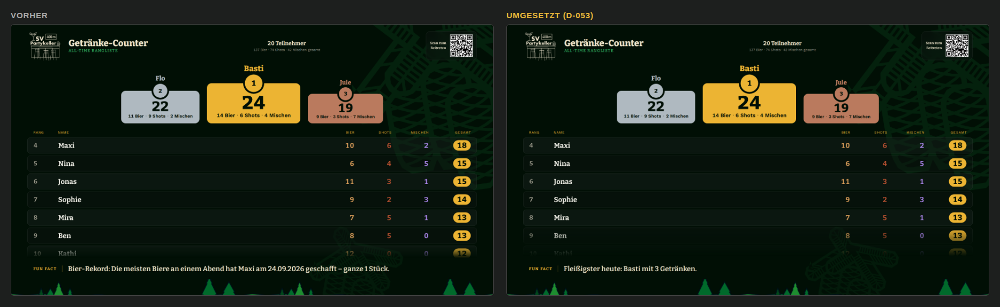

Vorher schnitt der 48-px-Verlauf die angeschnittene Zeile hart ab: Kante und
halbe Schrift blieben stehen. Jetzt blendet die Liste über knapp zwei Zeilen
aus und ist am Rand schon ganz durchsichtig. Die Rotation rechnet einen Schritt
weiter, sodass am Listenende der letzte Platz voll lesbar über dem Verlauf steht.

### E1 – TV-Kopf: Mitte auf der Podest-Achse, lesbarer vom Sofa aus

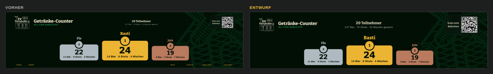

- Der Kopf wird ein Raster `1fr auto 1fr`. „20 Teilnehmer" steht damit genau
  über Platz 1, heute liegt es rund 140 px daneben, weil links und rechts
  unterschiedlich breit sind.
- Die Bilanzzeile wächst von 14 auf 20 px, die Teilnehmerzahl von 22 auf 30 px.
  14 px sind auf drei Meter Abstand nicht lesbar.
- QR-Code 90 → 128 px, „Scan zum Beitreten" 14 → 20 px. Das Scannen klappt
  so auch von weiter weg.
- Tabellenkopf 14 → 16 px, Name auf Platz 1 32 → 38 px.

### E2 – Anmeldung mit vielen Konten

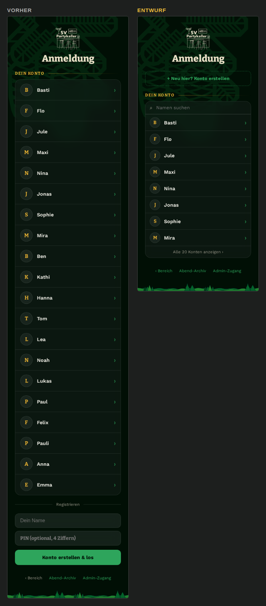

Bei 20 Konten rutscht „Konto erstellen" auf gut 1.600 px Höhe, also drei
Bildschirme tief. Wer neu ist, sieht es nicht.

- Oben ein Knopf „+ Neu hier? Konto erstellen", der das Formular aufklappt.
- In der Tafel ein Suchfeld „Namen suchen".
- Nur die ersten 8 Konten (das zuletzt benutzte steht wie gehabt oben,
  D-041), dazu „Alle 20 Konten anzeigen ›".
- Zeilen etwas kompakter (Namenszeichen 34 statt 40 px).
- Schrift in den Feldern einheitlich (A1), „‹ Bereich" in derselben Linkfarbe.

### E3 – Profil aufgeräumt (teilweise umgesetzt: A2, A12, A13)

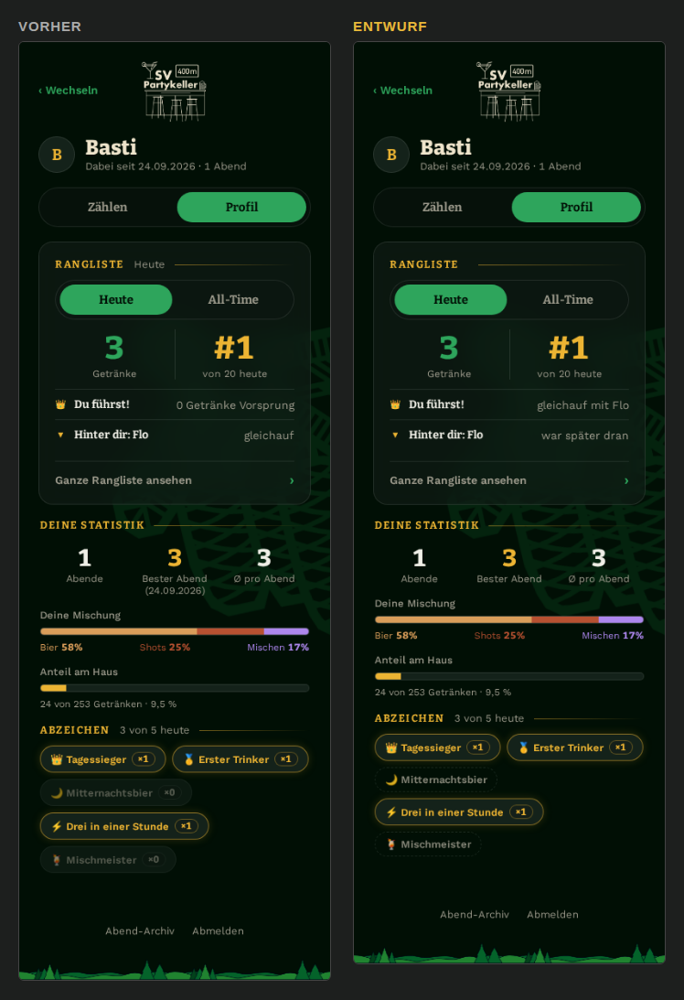

- „0 Getränke Vorsprung" → „gleichauf mit Flo", „gleichauf" beim Hintermann →
  „war später dran". Das erklärt den Tiebreak (D-020) gleich mit (A2).
- Doppelter Hinweis „Heute" neben RANGLISTE entfällt (A13).
- „Bester Abend" ohne Datum, die drei Zellen stehen wieder auf einer Linie (A12).
- Offene Abzeichen: gestrichelter Rand und volle Deckkraft statt 55 %, ohne
  „×0". Sie sind lesbar und bleiben klar von den geschafften unterscheidbar.

### E4 – Ganze Rangliste: Rangkreise wie auf dem TV ✅ umgesetzt (D-054)

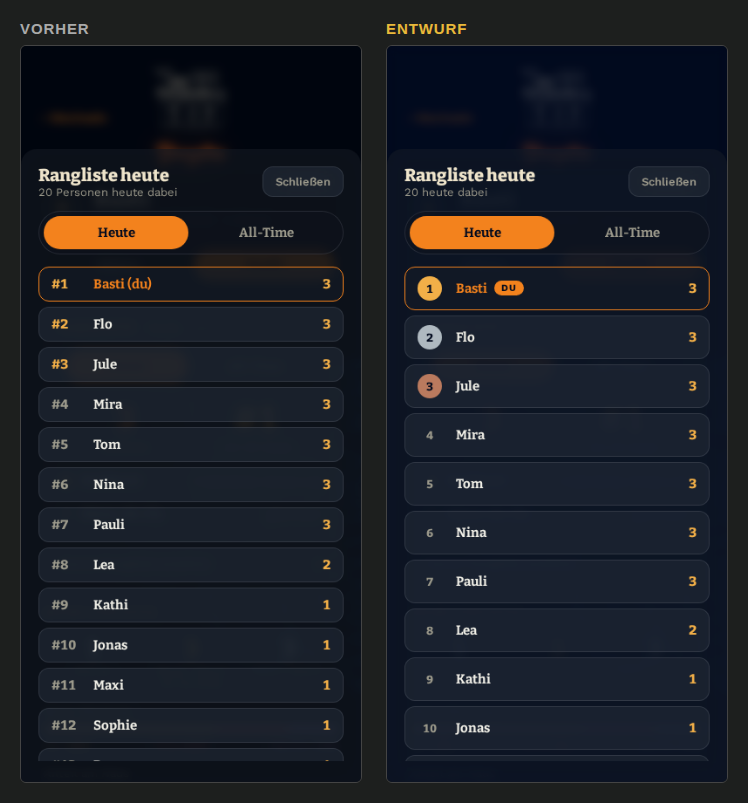

- Plätze 1–3 als Kreis in Gold/Silber/Bronze, alle Plätze ohne „#". Das Blatt
  sieht damit aus wie das TV.
- „Basti (du)" → Name + kleine „Du"-Pille.
- „20 Personen heute dabei" → „20 heute dabei" (wie auf dem TV).
- Hintergrund im Youngstars-Bereich navy statt grünstichig (A3).

### E5 – Onboarding passt zur echten Oberfläche ✅ umgesetzt (D-054)

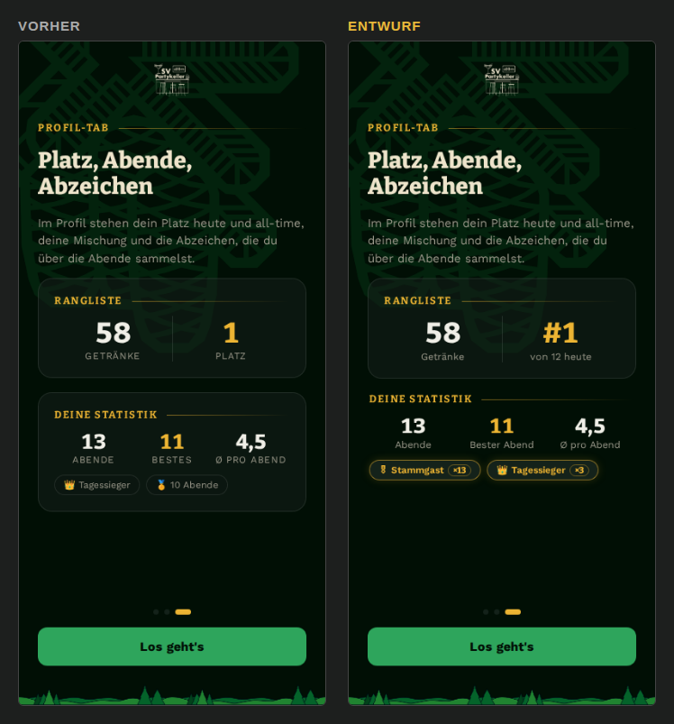
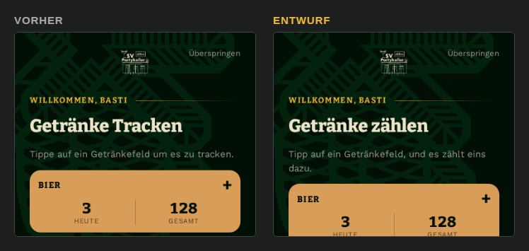

- Schritt 3 zeigt „#1 von 12 heute", Beschriftung in gemischter Schreibung,
  Statistik rahmenlos wie im Profil, Abzeichen „🎖 Stammgast ×13" und
  „👑 Tagessieger ×3" im echten Abzeichen-Stil (A7).
- Schritt 1: „Getränke zählen" / „Tipp auf ein Getränkefeld, und es zählt
  eins dazu." (A6).
- Außerdem, nicht im Bild: Logo wie auf der Anmeldung (72 px statt 44 px) und
  die Reihenfolge der Felder im Youngstars-Bereich wie im Dashboard (A8).

### E6 – Admin: gefährliche Knöpfe weg vom Alltag (abgelöst durch E7)

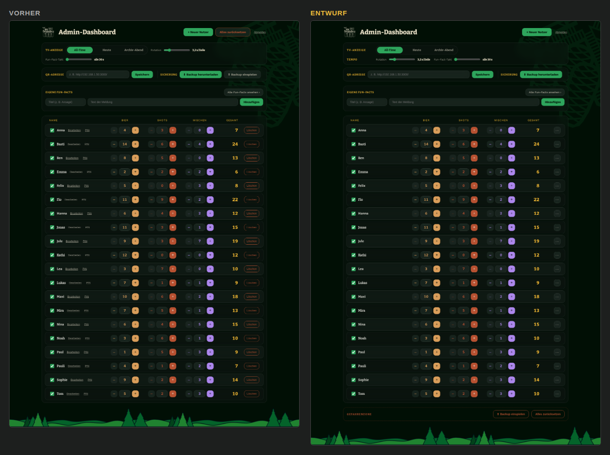

- „Alles zurücksetzen" steht heute direkt neben „+ Neuer Nutzer" im Kopf. Es
  zieht zusammen mit „⬆ Backup einspielen" in eine **Gefahrenzone** am
  Seitenende (gestrichelter Rahmen in brick).
- TV-Panel als Raster *Etikett | Steuerung*: „TV-Anzeige" mit dem Umschalter,
  darunter „Tempo" mit Rotation und Fun-Fact-Takt. Heute bricht der
  Fun-Fact-Regler bei 1440 px allein in eine zweite Zeile um.
- In jeder Zeile ersetzt ein „⋯"-Knopf „Bearbeiten", „PIN" und „Löschen". Das
  spart 60 unterstrichene Links und 20 rote Knöpfe, die Zeilen lesen sich
  als Zahlen.
- Nicht im Bild: Dialoge ohne grüne Oberkante (A9), „+ Neues Konto" statt
  „+ Neuer Nutzer" (B).

### E7 – Admin im aktuellen Design (ersetzt E6) ✅ umgesetzt (D-061)

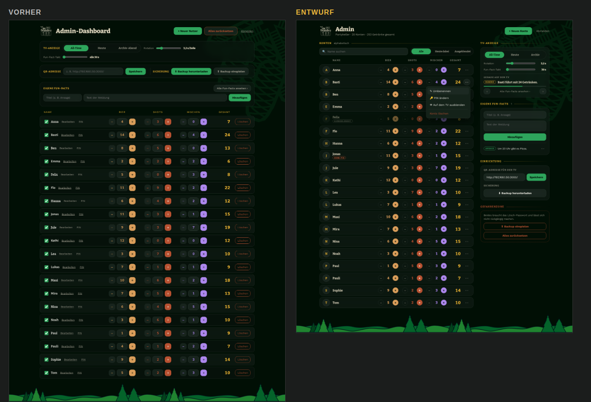

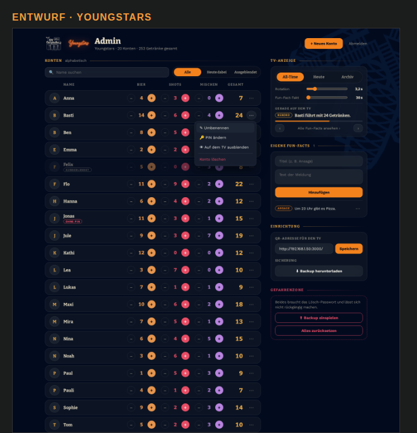

Das Panel um die Namenszeilen ist schon weg (D-060). Der Entwurf übernimmt
E6 (Gefahrenzone, ⋯-Menü) und zieht den Admin auf die Formensprache von
Dashboard und Profil:

- **Kopf wie im Profil:** „Admin“ mit Unterzeile *Partykeller · 20 Konten ·
  253 Getränke gesamt* statt „Admin-Dashboard“. Rechts nur „+ Neues Konto“
  und ein leiser Link „Abmelden“ ohne Unterstreichung (wie die Fußlinks im
  Dashboard).
- **Zwei Spalten statt fünf gestapelter Kästen:** links die Konten, rechts
  eine mitlaufende Seitenleiste (`position: sticky`). Der TV bleibt beim
  Korrigieren von Zählern in Sichtweite. Auf dem Handy wird daraus ein
  Umschalter (siehe unten).
- **Abschnitte mit `.sec-title`** (Gold-Versalien plus auslaufende
  Haarlinie) statt Glas-Kästen mit eigener Überschrift: *Konten*,
  *TV-Anzeige*, *Eigene Fun-Facts*, *Einrichtung*, *Gefahrenzone*. Damit
  gilt auch die einheitliche Laufweite 0.12em (B).
- **Konten-Zeilen:** Namenskreis (`.avatar`) wie in Anmeldung und Profil.
  Stepper mit runden Knöpfen: „–“ als leiser Umriss, „+“ gefüllt in der
  Getränkefarbe wie die Zählkarten. Die Zahl steht ohne eigenes Feld in der
  Getränkefarbe. Ein Klick auf die Zahl öffnet weiterhin die direkte
  Eingabe. Gesamt in Gold.
- **⋯-Menü pro Zeile** (im Bild bei Basti offen): *Umbenennen*, *PIN
  ändern*, *Auf dem TV ausblenden*, abgesetzt *Konto löschen* in brick. Das
  ersetzt die Häkchen, „Bearbeiten“, „PIN“ und die 20 roten
  „Löschen“-Knöpfe. Ausgeblendete Konten sind abgedunkelt und tragen einen
  Chip *ausgeblendet*, Konten ohne PIN den Chip *ohne PIN* (beide im Stil
  der Fun-Fact-Chips).
- **Suche und Filter** über der Liste: *Alle / Heute dabei / Ausgeblendet*
  als Umschalter mit gleitendem Balken wie im Profil.
- **TV-Karte:** Umschalter, darunter Rotation und Fun-Fact-Takt als Raster
  *Etikett | Regler | Wert*. Darunter läuft *Gerade auf dem TV* mit
  Restzeit-Balken und ‹ › direkt in der Karte. Das Fenster „Alle Fun-Facts
  ansehen“ bleibt für die ganze Liste.
- **Eigene Fun-Facts:** Titel und Text untereinander (der Text als
  zweizeiliges Feld). Die vorhandenen Meldungen stehen darunter mit Chip
  und ⋯.
- **Einrichtung:** QR-Adresse und „Backup herunterladen“. **Gefahrenzone**
  (gestrichelt in brick, mit Hinweis auf das Lösch-Passwort): „Backup
  einspielen“ und „Alles zurücksetzen“.
- Nicht im Bild: Dialoge ohne Änderung. Beim Umsetzen ziehen die
  Admin-Inline-Styles in Klassen (C).

**Auf dem Handy:**

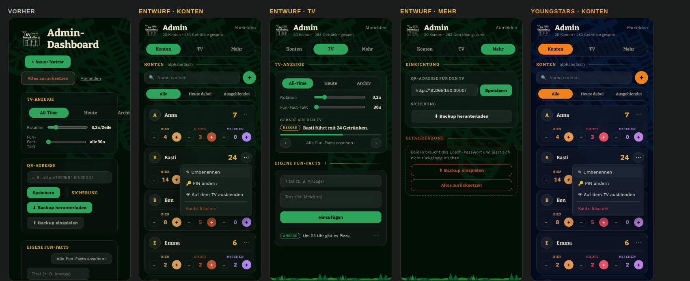

Heute ist der Admin auf dem Handy rund 6 300 px lang. Die drei Stepper
stehen je Konto untereinander und haben keine Getränke-Beschriftung, der
TV-Umschalter läuft rechts aus dem Bild („Archi…“). Im Entwurf:

- **Umschalter *Konten | TV | Mehr*** unter dem Kopf, wie *Zählen | Profil*
  im Dashboard. *TV* enthält TV-Anzeige und eigene Fun-Facts, *Mehr* die
  Einrichtung und die Gefahrenzone. Die Konten sind damit sofort da, ohne
  an vier Kästen vorbeizuscrollen.
- **Konto als Karte in zwei Zeilen:** oben Namenskreis, Name, Gesamt in
  Gold und ⋯. Darunter, abgetrennt durch eine Haarlinie, die drei Stepper
  nebeneinander, jeweils mit *BIER / SHOTS / MISCHEN* in der Getränkefarbe
  darüber. 20 Konten brauchen so etwa 3 000 px statt heute rund 6 300 px.
- „+ Neues Konto“ wird ein runder +-Knopf neben der Suche. Im Kopf bleibt
  nur „Abmelden“. Die Unterzeile lässt den Bereichsnamen weg, den zeigt
  schon das Logo.
- Das Youngstars-Logo im Kopf entfällt auf dem Handy aus Platzgründen, die
  Farben zeigen den Bereich.

**Zu entscheiden:** Soll es zwei Spalten geben, oder eine Spalte wie heute
mit denselben Bausteinen? Sind Suche und Filter gewollt? Soll die direkte
Zahleneingabe bleiben, oder reichen – und +?

---

## Vorschlag zur Reihenfolge

1. **A1–A13 + Bausteine nach `theme.css`**: kein Design-Umbau, nur Fehler und
   Aufräumen. Kann ohne weitere Entscheidung umgesetzt werden.
2. **E3 + E4 + E5**: kleine, sichtbare Verbesserungen auf dem Handy.
3. **E1**: TV-Kopf (am besten einmal am echten Fernseher gegenprüfen).
4. **E2 und E7**: größere Umbauten von Anmeldung bzw. Admin. Davor
   entscheiden, ob Suche und ⋯-Menü gewollt sind.
