# Inspiration landonorris.com: Entwürfe L1–L5 (Stand 2026-09-28)

**Status:** L4 ist umgesetzt (D-067). L1, L2, L3 und L5 sind Entwürfe und
warten auf eine Auswahl.

Die Seite [landonorris.com](https://landonorris.com/) ist eine Fan- und
Markenseite. Man scrollt durch Fotos und Geschichten und bekommt
Stimmung. Unsere App ist ein Werkzeug: Am Handy wird schnell getippt, der TV
wird vom Sofa aus gelesen. Vieles von der Seite passt deshalb nicht. Einige
Ideen lassen sich aber gut übertragen. Das sind die, die **Momente**
betonen oder **Geschichte** zeigen, ohne das Zählen zu stören.

Die Entwürfe nutzen nur das, was wir schon haben: unsere Farben und
Schriften (Bitter und Work Sans), die Rangfarben und beide Bereiche. Alles
ist Inline-SVG oder CSS, braucht also kein Internet und keine neue
Abhängigkeit.

## Was von der Seite übernommen werden kann

| Element auf landonorris.com | Übertragung | Entwurf |
|---|---|---|
| Handgezeichneter Kringel („ON“ über „TRACK“), Unterschrift, die sich selbst zeichnet | Kringel und Pfeil zeichnen sich auf dem TV, wenn etwas passiert | L1 |
| Große Versal-Headlines, einzelne Wörter als Serif in der Akzentfarbe | Kennzahlen-Satz im Abend-Archiv, Startseite | L2 |
| „Helmets Hall of Fame“: Karten mit schräger Kerbe und Etikett unten rechts | „Hall of Fame“ der Abendsieger im Archiv | L3 |
| Lorbeer-Emblem („McLaren F1 since 2019“) | Lorbeer um den Namenskreis, Chip „3× Abendsieger“ | L4 |
| Höhenlinien als Hintergrund | Startseite, optional auf dem TV statt der Zapfen | L5 |

## Was bewusst nicht passt

- **Neon-Lime als Akzent.** Das ist Landos Markenfarbe. Unsere Akzente
  bleiben Grün und Gold bzw. Orange und Gold.
- **Große Fotos und Collagen.** Wir haben keine Fotos, und Porträts der
  Gäste wären ein Datenschutz-Thema.
- **3D-Helm, Scroll-Effekte, Cursor-Effekte.** Der TV hat keine Maus, am
  Handy gibt es kein Hover. Auf einem Pi wäre das außerdem zu schwer.
- **Lange Scroll-Geschichten auf dem Handy.** Die Zählseite muss sofort
  bedienbar sein.

---

## L1 – TV: Kringel bei Führungswechsel (Momente)

Wechselt die Spitze, zeichnet sich in etwa 0,8 s ein goldener Kringel um
den neuen Namen auf dem Podest. Dazu kommen ein Pfeil und „Neue Nr. 1!“.
Im Fun-Fact-Band erscheint der Moment „Führungswechsel“ mit einem
handgezeichneten Unterstrich unter dem Namen. Nach etwa 20 Sekunden
blendet alles wieder aus.

Dieselben Formen passen auch zu anderen Momenten, die der Server schon
kennt (D-036): Meilenstein, Rekordkurs, Hausmarke.

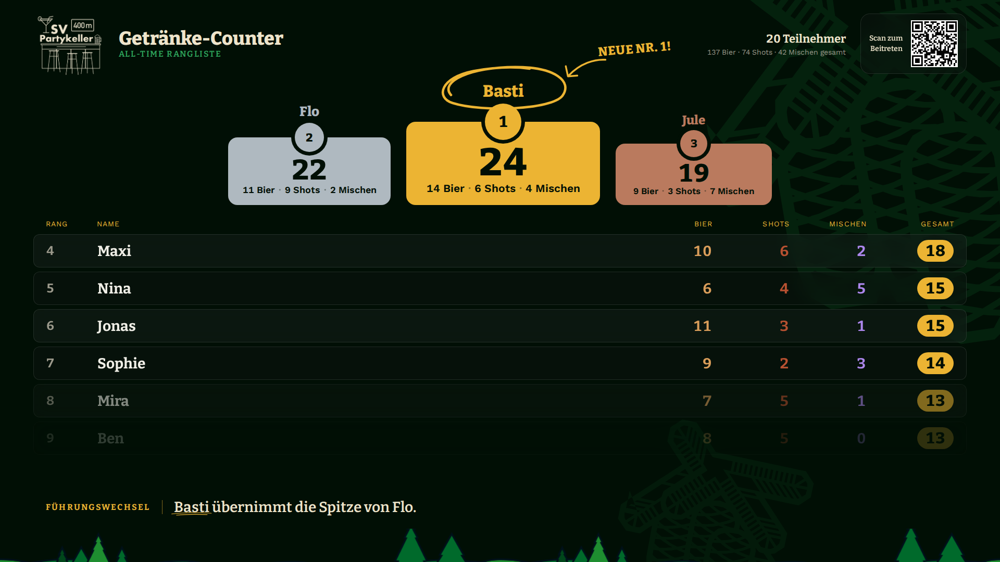

Ablauf der Animation:

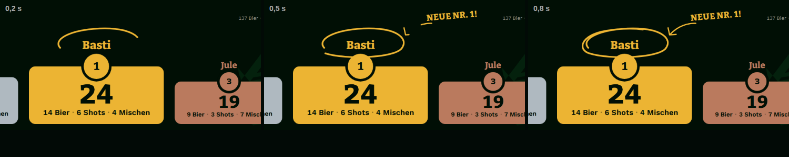

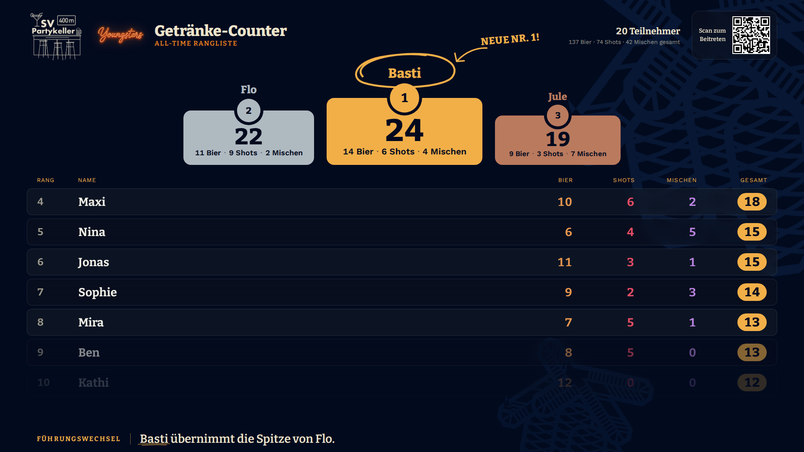

**Technik:** SVG-Pfad mit `pathLength="1"`, gezeichnet über
`stroke-dashoffset`. Das ist eine reine CSS-Animation und kostet kaum
Rechenleistung. Bei `prefers-reduced-motion` erscheint der Kringel ohne
Animation. Nötig ist nur ein Auslöser im TV, der das bestehende
`funStats.newLeader` bzw. den Platzwechsel auf dem Podest nutzt.
**Aufwand:** klein.

## L2 – Große Headline mit Serif-Akzent (Abend-Archiv, Startseite)

Oben im Abend-Archiv steht ein Satz aus den Kennzahlen: „24 **Abende**,
3 412 Getränke, ein **Keller**.“ Er ist in Work Sans fett und in
Versalien gesetzt, die Akzentwörter in Bitter und Gold. Darüber sitzt eine
kleine Zeile mit Lorbeer („Abend-Archiv · seit 2024“).

Auf der Startseite funktioniert das genauso: „Wo wird **heute** gezählt?“
(siehe L5).

Die Zahlen kommen aus `/api/archive`: Anzahl Abende, Summe der Getränke,
erster Abend. **Aufwand:** klein.

## L3 – Hall of Fame der Abendsieger (Kerben-Karten)

Unter der Headline zeigt eine Galerie die Sieger der letzten Abende. Jede
Karte hat den Namenskreis im Lorbeer und den Namen. Unten rechts sitzt ein
Etikett in einer schrägen Kerbe mit Datum und Getränkezahl. Der
Rekord-Abend ist golden hinterlegt.

Am Handy gibt es zwei Spalten, am Desktop vier. Darunter folgen wie bisher
„Alle Abende“ als Karten.

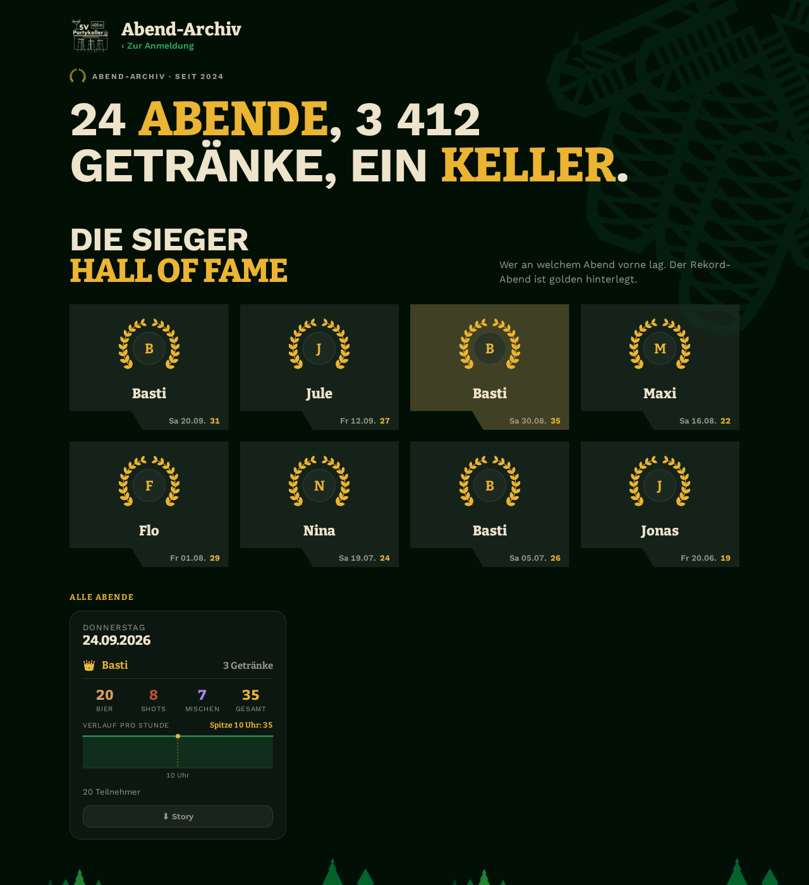

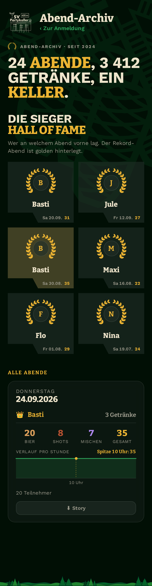

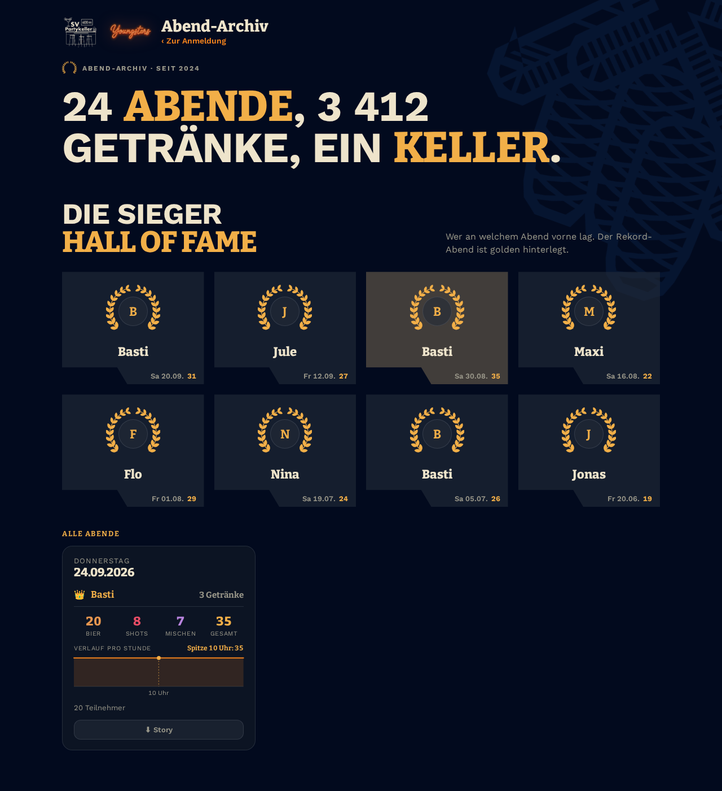

**Technik:** Die Kerbe ist ein `clip-path: polygon(...)`. Die Sieger je
Abend liefert `getArchive()` schon heute. **Aufwand:** klein bis mittel.

**Variante:** Wenn acht Lorbeerkränze zu viel sind, bekommt ihn nur der
Rekord-Abend. Die anderen Karten zeigen dann nur den Namenskreis.

## L4 – Lorbeer-Emblem im Profil ✅ umgesetzt (D-067)

Im Dashboard-Kopf steht der Namenskreis in einem goldenen Lorbeerkranz.
Daneben zeigt ein Chip „3× Abendsieger“, dahinter kommt „Dabei seit 2024“.

Den Kranz gibt es erst ab dem ersten Abendsieg. Vorher bleibt der Kopf wie
heute, damit das etwas bedeutet.

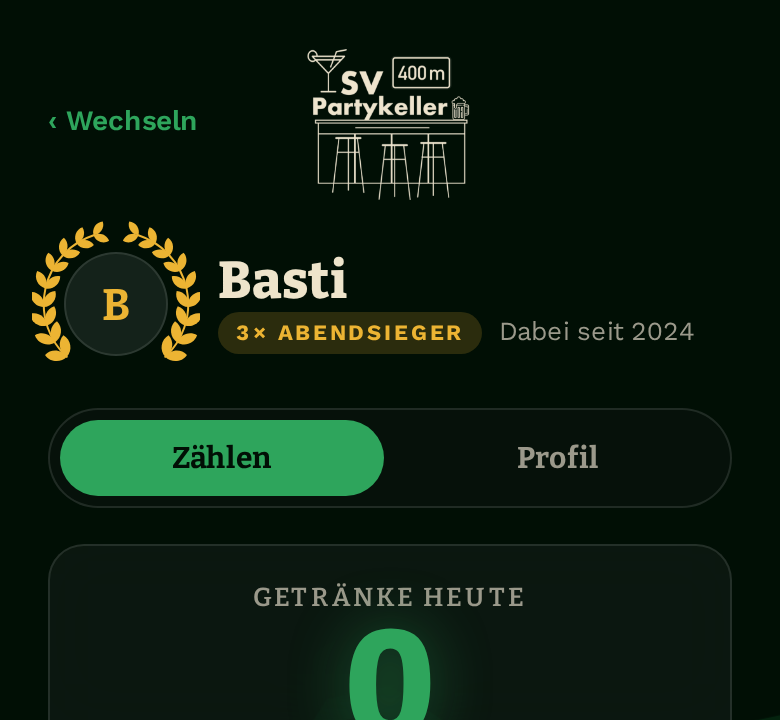
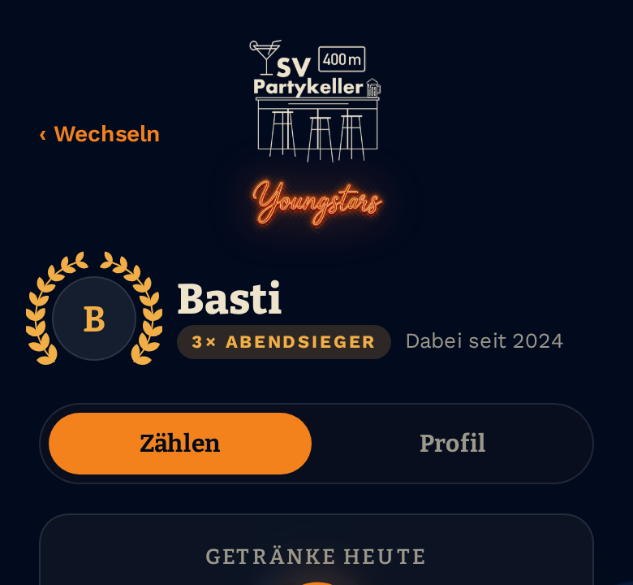

Die Zahl der Tagessiege steht schon in der persönlichen Statistik.
**Aufwand:** klein.

## L5 – Höhenlinien als Hintergrund

Feine, wellige Höhenlinien als ruhige Fläche, wie auf landonorris.com.

- **Startseite (Empfehlung).** Die neutrale Auswahlseite ist bisher leer.
  Die Linien geben ihr Tiefe, ohne einen der beiden Bereiche zu bevorzugen.
  Die Headline ist wie in L2 gesetzt.
- **TV (nur zum Vergleich).** Die Linien ersetzen dort die Zapfen. Die
  Zapfen sind aber Teil der Partykeller-Identität, deshalb eher **nicht**
  zu empfehlen.

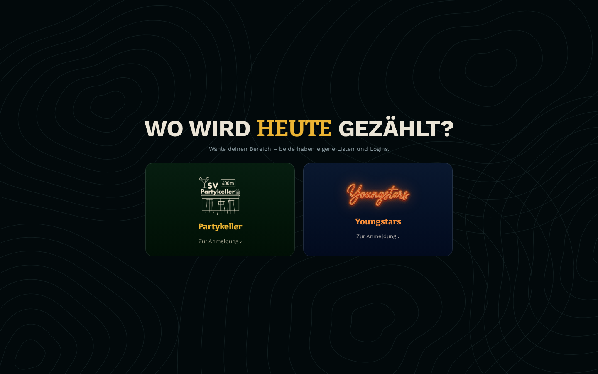
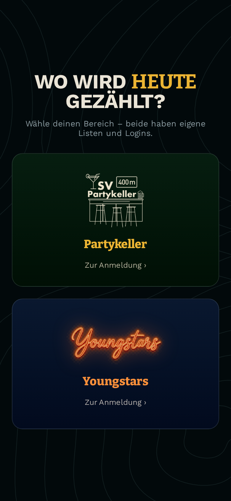
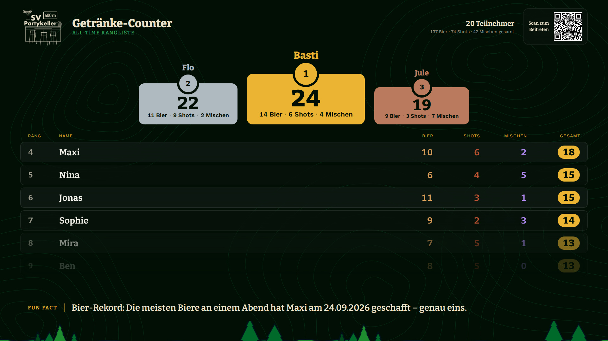

**Technik:** Eine statische SVG-Datei in `public/assets/`, einmal erzeugt.
**Aufwand:** klein.

---

## Vorschlag zur Reihenfolge

1. **L1** bringt am meisten Stimmung auf den TV, genau in den Momenten, in
   denen alle hinschauen.
2. **L3 + L2** machen das Abend-Archiv zu einer „Chronik“ des Kellers.
3. **L4** als Belohnung im Profil.
4. **L5** nur auf der Startseite.
