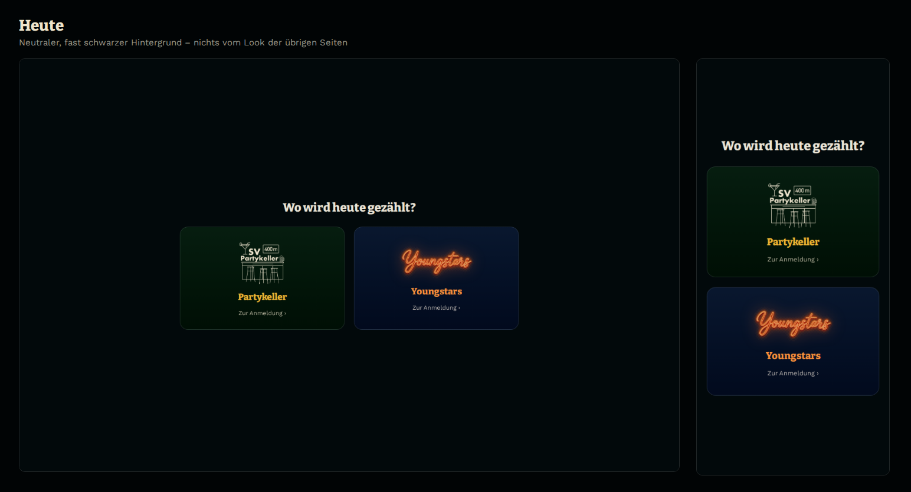
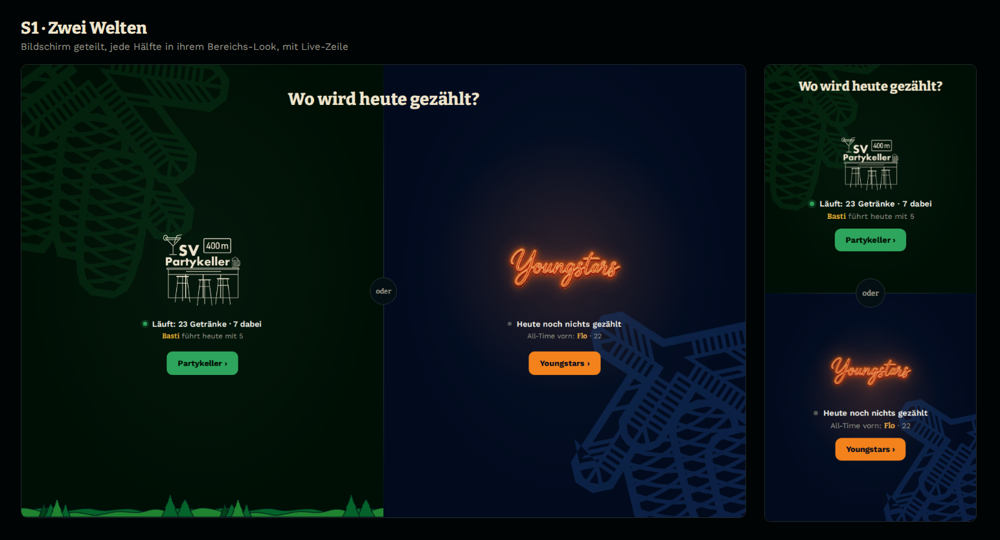
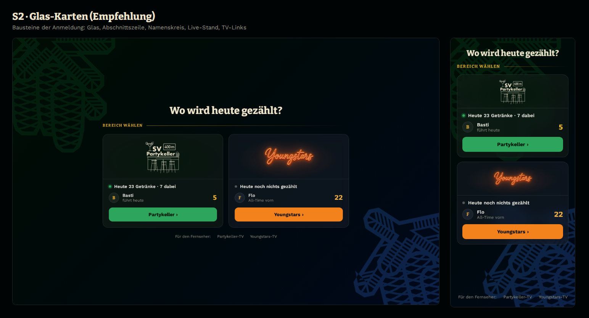
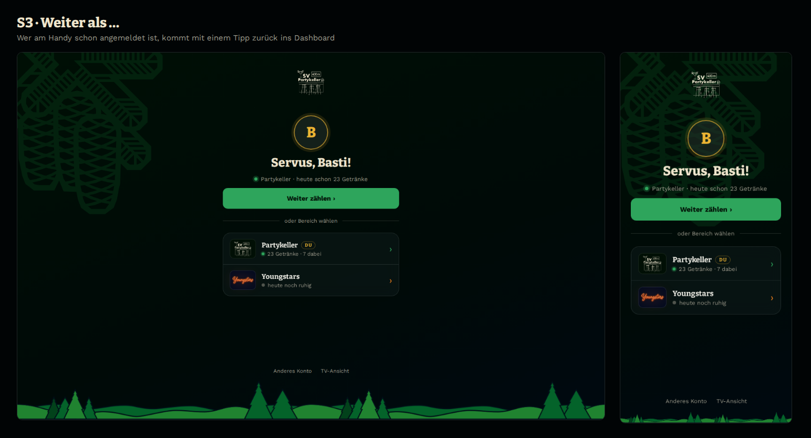
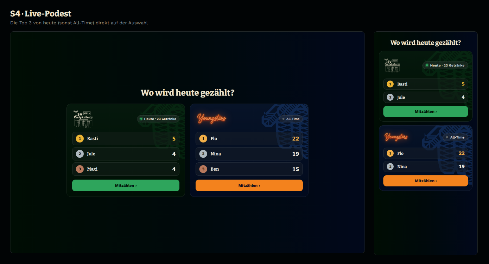

# Startseite / Bereichsauswahl: Entwürfe S1–S4 (Stand 2026-10-09)

**Status:** Entwürfe, noch nicht umgesetzt — wartet auf Auswahl.

Die Bilder in `docs/startseite/` sind echte HTML-Mockups mit `theme.css` und
den Assets aus `public/assets/`, im Browser aufgenommen (Desktop 1440 px,
Handy 390 px). Die Zahlen sind Beispielwerte: ein laufender Abend im
Partykeller, ein ruhiger Abend bei den Youngstars.

---

## Was heute nicht passt

Die Startseite (`public/start.html`) stammt aus D-019 und wurde danach kaum
angefasst. Alle anderen Seiten haben sich seitdem weiterentwickelt.

| # | Was | Wie es auf den anderen Seiten aussieht |
|---|-----|----------------------------------------|
| 1 | Fast schwarzer, leerer Hintergrund | Zapfen-Wasserzeichen, Wald-Footer, Farbton des Bereichs |
| 2 | Karten mit festem Verlauf, kein Glas | Glas-Flächen mit `--surface` und `--glass-edge` (D-044, D-054) |
| 3 | Logo **und** Name doppelt („SV Partykeller“-Logo + „Partykeller“) | Logo steht für sich |
| 4 | „Zur Anmeldung ›“ als blasser Hinweis | Klarer Knopf in der Bereichsfarbe |
| 5 | Keine Information, nur zwei Türen | Live-Stand überall (TV, Dashboard, Archiv) |
| 6 | Wer schon angemeldet ist, muss trotzdem erst wählen und landet auf der Anmeldung | — |
| 7 | Kein Weg zum TV, ohne die Adresse zu kennen | — |

---

## S1 – Zwei Welten

Der Bildschirm wird geteilt. Jede Hälfte zeigt ihren Bereich im eigenen
Look: links Grün mit Zapfen und Wald, rechts Navy mit Neon-Glühen und
Navy-Zapfen. Am Handy liegen die Hälften übereinander. Eine Live-Zeile
zeigt, ob dort gerade gezählt wird, und darunter steht ein Knopf in der
Bereichsfarbe. In der Fuge sitzt ein „oder“.

- **Stärke:** Der stärkste Auftritt. Man sieht sofort, welche Welt man betritt.
- **Schwäche:** Er nutzt wenig von den Bausteinen der übrigen Seiten (Glas,
  Abschnittszeile). Am Handy ist jede Hälfte nur halb so hoch.
- **Aufwand:** klein.

## S2 – Glas-Karten (Empfehlung)

Die heutigen Karten bekommen die Bausteine der Anmeldung: Glas-Fläche,
Abschnittszeile „Bereich wählen“ mit Gold-Haarlinie, Namenskreis und beide
Zapfen-Wasserzeichen (grün oben links, Navy unten rechts) auf einem Verlauf
von Grün nach Navy. Jede Karte zeigt:

- oben das Logo, ohne den Namen zu wiederholen,
- die **Live-Zeile**: „Heute 23 Getränke · 7 dabei“ mit grünem Punkt, oder
  „Heute noch nichts gezählt“ mit grauem Punkt,
- **wer vorne liegt**: heute, sonst All-Time,
- einen vollen Knopf in der Bereichsfarbe.

Darunter steht eine kleine Zeile **„Für den Fernseher: Partykeller-TV ·
Youngstars-TV“**. Damit findet man die TV-Ansicht am Laptop ohne die Adresse.

- **Stärke:** Passt nahtlos zu Anmeldung, Admin und Archiv. Am Handy und am
  Laptop gleich gut.
- **Aufwand:** klein bis mittel. Die Live-Daten kommen aus den vorhandenen
  `GET /partykeller/api/state` und `/youngstars/api/state`, einmal beim
  Laden. Es gibt keinen WebSocket und keine Server-Änderung.

## S3 – „Weiter als …“ (Baustein, kombinierbar)

Ist das Handy in einem Bereich schon angemeldet (`pk_token` bzw. `ys_token`
im `localStorage`), begrüßt die Startseite mit Namenskreis und
**„Servus, Basti!“**. Der große Knopf „Weiter zählen ›“ führt direkt ins
Dashboard. Darunter folgt „oder Bereich wählen“ als Glas-Tafel wie die
Anmeldeliste, mit der Pille **Du** am eigenen Bereich.

- Ohne Anmeldung erscheint die normale Auswahl (S1, S2 oder S4).
- Bei Anmeldung in **beiden** Bereichen gibt es zwei Begrüßungszeilen statt
  einer großen.
- **Stärke:** Das ist der häufigste Weg — ein Gast kommt wieder. Er braucht
  dann einen Tipp statt zwei Seiten.
- **Aufwand:** klein. Der Name steht schon im `localStorage`
  (`pk_player_name`, D-068), und der Übergang (Namenskreis gleitet in den
  Dashboard-Kopf) lässt sich wiederverwenden.

## S4 – Live-Podest

Jeder Bereich ist eine kleine Rangliste mit Rangkreisen in
Gold/Silber/Bronze, wie im Ranglisten-Blatt (E4) und auf dem TV. Läuft ein
Abend, steht „Heute · 23 Getränke“ darüber, sonst „All-Time“. Am Handy
werden nur die ersten zwei gezeigt.

- **Stärke:** Macht neugierig und bringt etwas vom Wettkampf schon auf die
  Startseite.
- **Schwäche:** Er verrät den Stand vor der Anmeldung. Bei einem ruhigen
  Abend wirkt die All-Time-Liste beliebig. Am Handy ist er am dichtesten.
- **Aufwand:** mittel.

---

## Für alle Entwürfe gleich

- **Übergang (D-068) bleibt:** Das Logo der gewählten Karte gleitet weiter
  in den Kopf der Anmeldung.
- **Saison-Akzente (D-071)** lassen sich anhängen, z. B. die Wimpelkette
  oben zum Oktoberfest. Die Startseite kennt den Admin-Schalter
  `seasonal` aus beiden States.
- **Offline:** Fehlt die Antwort der State-Abfrage, bleiben die Live-Zeilen
  einfach weg, und die Karten funktionieren weiter wie heute.

## Vorschlag

**S2 + S3:** Glas-Karten als Grundseite. Wer schon angemeldet ist, sieht
vorne „Weiter als …“.
